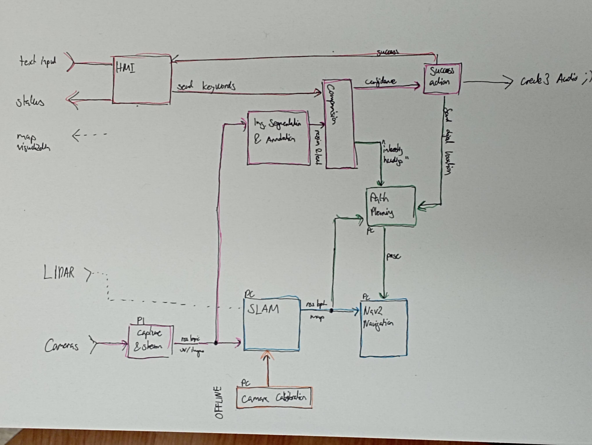

# Architecture

This document describes the overall architecture – **work in progress**

The following paths are highlighted in different colors:

- _pink_: basic functionality, needs to be implemented by us – can be used if robot just runs on teleop
- _blue_: SLAM & Navigation, can be largely adopted from existing packages with lots of possible changes
- _orange_: camera calibration as needed for grade, only needed for blue path with our own camera
- _green_: route fining, needs to be implemented by us, potentially quite some work – only makes sense if rest works, can be simulated by teleop with SLAM generated map
- _red_: HMI – just packages it all up nicely

## Capture & Stream

Key Idea: Capture the images and stream them to some ROS topic for further processing

## Image Segmentation & Annotation

Key Idea: use some framework presented during the presentations to do image segmentations ↝ Segment Anything maybe

- Input: Image
- Output: Regions with labels

## Comparision

Key Idea: give a confidence value if the user objective is really in the picture and eventually a heading for path planning

Note: can be very straight forward at first, might get more sophisticated with time (e.g. memory)

## Success Action

Key Idea: need to signal user that object was found and prohibit object from being found again!

Note: Keep minimal at first, only start marking once the path planning is made. There is the option to play sounds on the Create3, cf [here](https://github.com/iRobotEducation/irobot_create_msgs/blob/rolling/msg/AudioNoteVector.msg) (from [doc](https://turtlebot.github.io/turtlebot4-user-manual/software/create3.html))

## SLAM and Calibration

SLAM requires calibrated cameras. Unsure if this varies from SLAM to SLAM stack, or if there exists a "golden standard" for calibration.

- ORB-SLAMv3 has a tutorial in the repo

This calibration can be done offline.

It should only be a few lines in opencv? cf. ChatGPT

Idea: maybe add a depth map view to show calibration (since it is a big part of the grade?!)

## SLAM

Key idea: publish a map from sensor data

- Implementation
    - from scratch (lots of work, not gonna be faster unless done in CPP)
    - [SLAM Toolbox](https://github.com/SteveMacenski/slam_toolbox) (easily available and easy to deploy)
        - also what turtlebot uses with `ros2 launch turtlebot4_navigation slam.launch.py`
        - cf. githubrepo: [package dependencies](https://github.com/turtlebot/turtlebot4/blob/humble/turtlebot4_navigation/package.xml)
    - [ORB-SLAMV3](https://github.com/UZ-SLAMLab/ORB_SLAM3) (state of the art, has python bindings(?))
        - unsure how to use LiDar

- Notes
    - map can be visualized with `ros2 launch turtlebot4_viz view_robot.launch.py`

- Sources
    - [Turtlebot Tutorial (Generating Map)](https://turtlebot.github.io/turtlebot4-user-manual/tutorials/generate_map.html)

## SLAM and Navigation

Key idea: using SLAM to build a map on the go and navigate using _Nav2_

- SLAM publishes to `/map` topic, provide map->odom transformation (?)
- Navigation is than handled by Nav2
- works out of the box for SLAM Toolbox, needs more work for ORB-SLAMv3

- Sources
    - Relevant Site in [Nav2 Doc](https://docs.nav2.org/tutorials/docs/navigation2_with_slam.html)

## Navigation

Key idea: use existing navigator in turtlebot, relies on Nav2SimpleCommander

- launch navigation stack `ros2 launch turtlebot4_navigation nav2.launch.py`
- somehow generate goals

- Sources
    - Tutorial in [TurtlebotDoc](https://turtlebot.github.io/turtlebot4-user-manual/tutorials/navigation.html)
    - Nav2: Simple Commander on [GitHub](https://github.com/ros-navigation/navigation2/tree/galactic/nav2_simple_commander) (for light documentation)

## SLAM and Pose Planning for Navigation

Key idea: overlay map with a grid of poses, decided which ones to visit next

- SLAM publishes maps in `pgm` format and with `yaml` descriptions

More info: ask ChatGPT: how to do the above

> I would like to explore a map (which is changing) based on pgm files. how would I do this? The pgm files stem from a SLAM in ros and the output should be poses for easynavigator in the nav2 stack

Difficulty: include heading information of where is something interesting ↝ need to think about this once this far

## Path Planning

Key Idea: Tying everything together from map and object detection → Enables Robot to be autonomous!

Note: makes only sense once pink and blue path are established.

## HMI

Key Idea: Giving user some way to input data and see status/results

- Note
    - can be a simple shell cf. [cmd shell](https://docs.python.org/3/library/cmd.html)
    - adding some visualization from rviz would be cool

## Camera Calibration
1. 3D-triangulation Method using DLT: https://www.ipb.uni-bonn.de/html/teaching/msr2-2020/sse2-13-DLT.pdf

